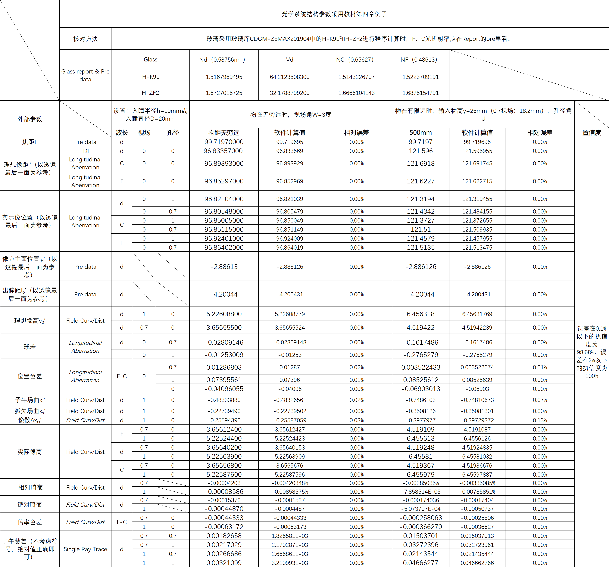

# simple-ray-tracing


## 1. 光路追迹计算程序说明

光线的计算程序写了三、四十个小时，在类的设计上花了不少功夫（速成面向对象叭），我认为程序具有可拓展性、易理解性，比如要进行光路追迹，只需要声明光线，便可利用`ray_tracing(ray,ku,kw)` 函数得到输出光线。


### Ray.h

光线类。

包含四种：

- 第一近轴光 FPR 
- 第二近轴光 SPR
- 第一实际光 FPR
- 第二实际光 SPR

#### 基类 Ray

定义了光线最基本的性质 l （物距/像距）和 U （入射/出射孔径角），以及一些备注信息 *rayinfo* （可选参数）。

声明基本光线 ray 有四种方式：

```c++
Ray ray1;
Ray ray2(l); // l为物距/mm
Ray ray3(rayinfo); // rayinfo 为字符串，可以根据需要传入
Ray ray4(l,rayinfo); // 同时输入物距和光线信息，但必须先输入物距
```

可以通过 *set_* 和 *get_* 方法对光线参数进行设置和取出。

可以通过 `show_rayinfo` 方法获得光线的相关信息，在 `Ray` 类中为虚函数，会根据不同的光线类型输出不同的光线信息，也可以输出用户自己设置的光线信息。


#### 第一近轴光 FPR

First Paraxial Ray 的缩写。

声明时必须提供物距 l , 可选参数为 *rayinfo*。 若物距为无穷远则 l=-INF, 其中 INF 设为了 1E15。

特有性质：U=0。


#### 第二近轴光 SPR

Second Paraxial Ray 的缩写。

声明时必须提供物距 l , 若物距为无穷远则需提供视场角 W，若物距为有限远则需提供像高 W, 类中利用 `y_or_W` 参数，根据物距自动判断。

注意在 `SPR` 类中，L 为*对应的* 物距，l 为实际物距（即和光轴的交点）。


#### 第一实际光 FRR

First Real Ray 的缩写。(一开始为 FAR 为 First Actual Ray，无奈与MFC中的一个指针重名)

声明时需要提供物距 l , 可选参数为光线信息 `rayinfo`。


#### 第二实际光 SAR

Second Actural Ray 的缩写。

声明时需要提供 *对应的* 物距 l, 像高 y 或者视场 W。 

可选参数为光线标签 `label` 和光线信息 `rayinfo` ，其中光线标签用 `"up","dn","cf"` 来分别表示上光线 (up)、下光线 (down)、主光线 (chief), 默认光线为主光线。

SAR 光的特有参数为 t,s 均为主光线所特有，在计算其像散、场曲时用到。


### Lens.h

透镜类。

描述一个光学系统中每个面的性质，拥有属性 `rho, n, d, X, PA` ，前三个依次代表表面的曲率，与下一表面之间的折射率，与下一表面之间的距离。后两个为计算像散场曲时的参数。之后的改进可以为去掉参数 X, 而在计算像散场曲时根据 PA设置 X。 

利用 `set_` 和 `get_` 方法可以进行属性的设置和获取。


### OptSys.h

光学系统类。

表示一个光学系统，可以根据入射光线进行光路追迹、计算各种像差。

系统参数为 `a,nsf,f,lH,lp,sf[],dists[],rs[],ns[],nds[]`, 依次表示系统的入瞳直径、总面数、有效焦距、相对最后一面的像方主面位置、出瞳距、系统拥有的所有面、系统每一面到下一面的距离、每一面的曲率半径、每一面与下一面之间折射率，最后一个 nds 是可选参数，表示非主色光入射时系统的依赖折射率（主色光折射率）。

声明：

```c++
Optsys(a,nsf,dists[],rs[],ns[]); 
// a为入瞳直径
// nsf为系统面数
// dists为数组，表示当前面到下个面的距离
// r系统中各面的半径
// ns为系统各面到下一面的折射率
```

声明时将自动生成系统参数，可以使用 `show_sysinfo` 方法查看。

**光路追迹函数** `ray_tracing` ，利用多态可以自动判断光线类型，所以只需要输入光线，即可得到输出光线，并利用 `get_` 方法得到输出光线的相关参数。下一步的改进可以是做成模版类。

例如，根据输入光线的参数：物距 l 、有限远像高 y 或者无限远视场 W, 便可利用 `Ray rayin(l),FPR rayin(l), SPR rayin(l,y_or_W), FRR rayin(l), SAR rayin(l,y_or_W);` 声明四种光线，然后利用 `Ray rayout; rayout = ray_tracing(rayin,ku,kw)`  即可得到某一光线光路追迹后的结果，其中 `ku,kw` 分别是孔径和视场因子，0.7孔径时 ku=0.7, 0.7视场时 kw=0.7, 若不填写则默认为 1 。

**像高计算函数** `cal_y0,cal_y` 可分别根据输入的物距、像高或视场计算理想像高和实际像高。

**像差计算函数**有 `cal_SA, cal_LCAx, cal_LCAy, cal_Distortion, cal_Coma, cal_FCs`, 分别计算球差、位置色差、倍率色差、畸变、彗差、像散和场曲。计算色差时需要提供 F光和 C光在系统每个面到下一面中的折射率。


### utils.h

一些工具函数。

包括 `Arc2Angle, Angle2Arc, myabs`, 分别为弧度转化为角度、角度转化为弧度、绝对值函数。


### cal_res

传入vector，将输出全部计算结果（系统参数、出射光参数、像差）到 vector 。

数组 *res* 的每一位依次为：

```tex
-- 系统参数 --
系统焦距 f', 像方主面位置 lH', 出瞳距 lp',

-- d光出射光参数 --
理想像距 ld0', 全孔径实际像距 ld', 0.7孔径实际像距 lud', 
全视场理想像高 yd0', 0.7视场理想像高 ywd0', 全视场实际像高 yd', 0.7视场实际像高 ywd',


-- F光出射光参数 --
理想像距 lf0', 全孔径实际像距 lf', 0.7孔径实际像距 luf', 
理想像高 yf0', 全视场实际像高 yf', 0.7视场实际像高 ywf',


-- C光出射光参数 --
理想像距 lc0', 全孔径实际像距 lc', 0.7孔径实际像距 luc', 
理想像高 yc0', 全视场实际像高 yc', 0.7视场实际像高 ywc',


-- 像差 --
全孔径球差 SA, 0.7孔径球差 SAu，
全孔径位置色差 LCAx, 0.7孔径位置色差 LCAxu, 0孔径位置色差 LCAxu0，
全视场倍率色差 LCAy, 0.7视场倍率色差 LCAyw,
初级子午场曲 xt', 初级弧矢场曲 xs', 初级像散 xts', 
全视场绝对畸变 adt, 0.7视场绝对畸变 adtw,
全视场相对畸变 rdt, 0.7视场相对畸变 rdtw,
全市场全孔径、全视场0.7孔径、0.7视场全孔径、0.7视场0.7孔径的子午彗差coma1,coma2,coma3,coma4 

```


### cal_test

测试程序。输出如下：


```tex
Optical System Parameters:
Surface Parameters:
1 th surface: radius -- 62.5 , distance to the next surface -- 4 , diffraction index -- 1.5168
2 th surface: radius -- -43.65 , distance to the next surface -- 2.5 , diffraction index -- 1.6727
3 th surface: radius -- -124.35 , distance to the next surface -- 60 , diffraction index -- 1
Effective Focal Length -- 99.7197
Main Surface Distance -- -2.88613
Exit Pupil Distance -- -4.20044

First Paraxial Ray:
Ray Information : FPR,rayout,inf
Aperture Angle U -- 5.745683
Distance l -- 96.83357
Ray Information : FPR,rayout,finite
Aperture Angle U -- 4.614059
Distance l -- 121.596

Second Paraxial Ray:
Ray Information : SPR,rayout,inf 
Aperture Angle U -- -2.959621
Distance l -- -4.200444
Ray Information : SPR,rayout,inf,0.7W 
Aperture Angle U -- -2.072218
Distance l -- -4.200444
Ray Information : SPR,rayout,finite
Aperture Angle U -- -2.936655
Distance l -- -4.200444

First Actual Ray:
Ray Information : FRR,rayout,inf 
Aperture Angle U -- 5.754339
Distance l -- 96.82104
Ray Information : FRR,rayout,inf,0.7U 
Aperture Angle U -- 4.025652
Distance l -- 96.80548
Ray Information : FRR,rayout,finite 
Aperture Angle U -- 4.639631
Distance l -- 121.3194
Ray Information : FRR,rayout,finite,0.7U 
Aperture Angle U -- 3.239016
Distance l -- 121.4342

Second Actual Ray
Ray Information : SAR
Aperture Angle U -- 2.844034
Distance l -- 201.0755
Ray Information : SAR
Aperture Angle U -- -2.960881
Distance l -- -4.197346
Ray Information : SAR
Aperture Angle U -- -8.691386
Distance l -- 62.29972

Ray Information : SAR
Aperture Angle U -- -7.545585
Distance l -- 72.58265
Ray Information : SAR
Aperture Angle U -- -2.937885
Distance l -- -4.197394
Ray Information : SAR
Aperture Angle U -- 1.76631
Distance l -- 326.7311

Exit Ray :
Ideal image height -- inf -- nd -- 5.226088
Ideal image height -- inf -- nd -- 0.7W --  3.656555
Ideal image height -- finite -- nd -- 6.456318
Ideal image height -- finite -- nd -- 0.7W --  4.519422
Actual image height -- inf -- nd -- 5.225639
Actual image height -- inf -- nd -- 0.7W -- 3.656402
Actual image height -- inf -- nf -- 5.225244
Actual image height -- inf -- nf -- 0.7W -- 3.656124
Actual image height -- inf -- nc -- 5.225876
Actual image height -- inf -- nc -- 0.7W -- 3.656568
Actual image height -- finite -- nd -- 6.45581
Actual image height -- finite -- nd -- 0.7W -- 4.519248
Actual image height -- finite -- nf -- 6.455613
Actual image height -- finite -- nf -- 0.7W -- 4.519109
Actual image height -- finite -- nc -- 6.455979
Actual image height -- finite -- nc -- 0.7W -- 4.519367

Aberrations : 
Absolute Distortion -- inf -- -0.0004486989
Relative Distortion -- inf -- -8.585751e-05
Absolute Distortion -- inf -- 0.7W -- -0.0001537026
Relative Distortion -- inf -- -4.203481e-05
Absolute Distortion -- finite -- -0.0005073707
Relative Distortion -- finite -- -7.858514e-05
Absolute Distortion -- finite -- 0.7W -- -0.000174036
Relative Distortion -- finite -- -3.850847e-05
Spheroical Aberration -- inf -- -0.01253009
Spheroical Aberration -- inf -- 0.7U -- -0.02809146
Spheroical Aberration -- finite -- -0.2765279
Spheroical Aberration -- finite -- 0.7U -- -0.1617486
Lateral Chromatic Aberration -- inf -- Aperture 0 -- -0.04096055
Lateral Chromatic Aberration -- inf -- Aperture 0.7 -- 0.01286803
Lateral Chromatic Aberration -- inf -- Aperture 1 -- 0.07395561
Lateral Chromatic Aberration -- finite -- Aperture 0 -- -0.06903013
Lateral Chromatic Aberration -- finite -- Aperture 0.7 -- 0.003522433
Lateral Chromatic Aberration -- finite -- Aperture 1 -- 0.08525612
Longitudinal Chromatic Aberration -- inf -- Aperture 0 -- nan
Longitudinal Chromatic Aberration -- inf -- Aperture 0.7 -- -0.0004433292
Longitudinal Chromatic Aberration -- inf -- Aperture 1 -- -0.0006317205
Longitudinal Chromatic Aberration -- finite -- Aperture 0 -- nan
Longitudinal Chromatic Aberration -- finite -- Aperture 0.7 -- -0.0002580625
Longitudinal Chromatic Aberration -- finite -- Aperture 1 -- -0.0003662791
Coma -- inf -- 0.003210993
Coma -- finite -- 0.04666277
Coma -- inf -- 0.7W -- 0.002170287
Coma -- finite -- 0.7W -- 0.03272396
Coma -- inf -- 0.7U -- 0.002666861
Coma -- finite -- 0.7U -- 0.02143544
Coma -- inf -- 0.7U&0.7W -- 0.001826581
Coma -- finite -- 0.7U&0.7W -- 0.01503701
Field Curvature -- inf -- xt-- -0.4833388 xs-- -0.2273949
Astigmatism -- inf -- -0.2559439
Field Curvature -- finite -- xt-- -0.7486103 xs-- -0.3508126
Astigmatism -- finite -- -0.3977977
[Finished in 0.9s]
```




## 2. 用户操作界面说明

见 Release/Ray Tracing 帮助文档

